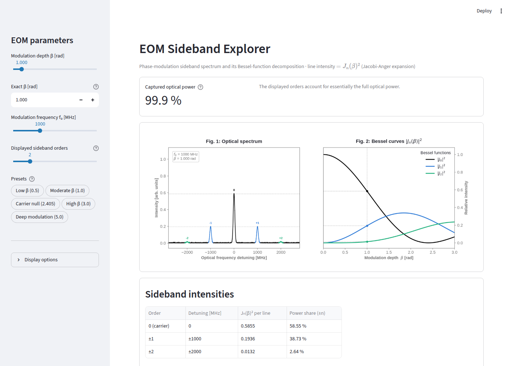

# EOM Sideband Explorer

An interactive [Streamlit](https://streamlit.io/) tool for visualizing the
optical sideband spectrum of an **electro-optic phase modulator (EOM)**.

Phase-modulating a laser at frequency *f₀* with modulation depth *β* produces a
carrier plus a symmetric set of sidebands at ±*n·f₀*, where each spectral line's
intensity is *Jₙ(β)²* (the Jacobi–Anger expansion). Drag the sliders and watch
the optical spectrum and the underlying Bessel functions update side by side.

**▶ Live demo: <https://eom-sideband-explorer.streamlit.app/>**



## Features

- **Two linked views.** The optical spectrum (Fig. 1) and the Bessel curves
  *|Jₙ(β)|²* (Fig. 2), with a marker showing how each peak height is a slice
  through the Bessel curves at your chosen *β*.
- **Live controls** for modulation depth *β*, modulation frequency *f₀*, and the
  number of sideband orders to display.
- **Preset operating points**, including the *carrier null* at *β ≈ 2.4048* used
  in the lab to measure a modulator's half-wave voltage *Vπ*.
- **Captured-power readout** with a spectral-truncation warning when the
  displayed orders miss a noticeable fraction of the optical power.
- **Exact intensity table** of *Jₙ(β)²* per line and the combined ±*n* power
  share for each order.
- **Colourblind-safe, theme-aware figures** that follow Streamlit's light/dark
  mode.
- A **Physics & model details** panel explaining the model, its assumptions, and
  further reading.

## Quick start

Requires **Python 3.11+**.

```bash
# 1. Clone the repository
git clone https://github.com/sterafix/eom-sideband-explorer.git
cd eom-sideband-explorer

# 2. (Recommended) create and activate a virtual environment
python -m venv .venv
source .venv/bin/activate        # on Windows: .venv\Scripts\activate

# 3. Install the runtime dependencies
pip install -r requirements.txt

# 4. Launch the app
streamlit run app.py
```

Streamlit prints a local URL (default <http://localhost:8501>); open it in your
browser.

## Project structure

The code is split into three small files so the physics can be understood,
reused, and tested independently of the user interface:

| File                    | Responsibility                                                        |
| ----------------------- | --------------------------------------------------------------------- |
| `physics.py`            | The numerical core — sideband intensities, captured power, and colours. No UI or plotting code, so it can be imported and unit-tested on its own. |
| `app.py`                | The Streamlit user interface — reads the controls, calls `physics.py`, and draws the figures. |
| `test_physics.py`       | Unit tests that pin down the physical properties of the model (energy conservation, symmetry, the carrier null, …). |
| `requirements.txt`      | Runtime dependencies — everything needed to *run* the app.            |
| `requirements-dev.txt`  | Development dependencies — the runtime set plus tools like the test runner. |
| `.streamlit/config.toml`| Streamlit theme settings.                                             |
| `.github/workflows/ci.yml` | Continuous-integration workflow (compiles the code and runs the tests on every push and pull request). |

### Why two requirements files?

This is a common Python convention:

- **`requirements.txt`** lists only what is needed to *run* the app. If you just
  want to launch it, deploy it, or embed it on a website, this is the only file
  you need.
- **`requirements-dev.txt`** additionally installs the tools used to *develop*
  the app (currently `pytest`). It re-uses the runtime file via its first line
  (`-r requirements.txt`), so a single `pip install -r requirements-dev.txt`
  gives you everything.

## Development

Install the development dependencies and run the test suite:

```bash
pip install -r requirements-dev.txt
pytest
```

The tests cover the physics core only (`physics.py`); they run in well under a
second and require no display or browser.

## The physics in brief

An ideal phase modulator imprints a sinusoidal phase on a monochromatic laser
field:

```
E(t) = E₀ · exp( i[ ω_c·t + β·sin(ω_m·t) ] )
```

The Jacobi–Anger identity expands this into a carrier plus an infinite set of
sidebands spaced by the modulation frequency:

```
E(t) = E₀ · Σₙ Jₙ(β) · exp( i(ω_c + n·ω_m)·t )
```

so the line at detuning *n·f₀* has intensity *|Jₙ(β)|²*. Two properties follow:

- **Symmetry** — the +*n* and −*n* orders carry equal intensity.
- **Energy conservation** — Σₙ *|Jₙ(β)|²* = 1: phase modulation only
  redistributes optical power between the carrier and its sidebands.

The in-app **Physics & model details** panel covers this in more depth,
including the carrier-null *Vπ* measurement and the idealizations of the model.

## Using and adapting this project

This project is MIT-licensed (see [`LICENSE`](LICENSE)), so you are free to use,
modify, and embed it — for example on the
[RP Photonics Encyclopedia](https://www.rp-photonics.com/encyclopedia.html) or
your own site. If you build on it or embed it, an attribution link back to this
repository is appreciated but not required.

## License

Released under the [MIT License](LICENSE). Copyright © 2026 Jonas Philipps.
